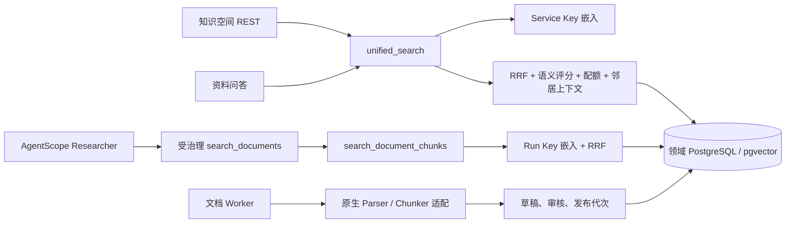
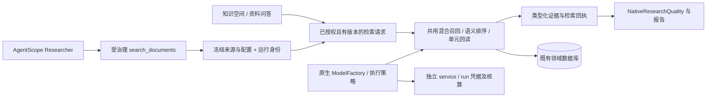

# InsightForge 知识库代码分析、同类产品调研与修改计划

调研日期：2026-10-03（Asia/Shanghai）。状态：用户已批准方案 A 的全部 P0、P1。本轮仅分析、执行隔离验证并生成设计文档，未修改业务源码、业务数据库、配置或依赖。

## 1. 结论

**知识库已部分通过 AgentScope 接入，检索与数据管理仍以项目领域服务为主。** 研究 Agent 原生使用 AgentScope 2.0.8；文档摄取实际使用继承 AgentScope ParserBase／ChunkerBase 的适配器；知识问答与语义评分使用 AgentScope OpenAIChatModel。项目还有 KnowledgeApplication 和 KnowledgeAccessPolicy 适配。

但是，正式 Researcher 的资料工具使用 documents/retrieval.py，知识空间检索／问答使用 knowledge/search_service.py，两者尚未共用同一条完整检索链。项目未装配 AgentScope KnowledgeBase／VectorStoreBase／RAGMiddleware 作为知识检索主入口，也未在正式配置中启用框架 KnowledgeBaseManager 接管知识库生命周期。

这不是“没有接入 AgentScope”，也不能仅凭未使用某个框架类判定功能缺失。当前最有价值的工作是补齐链路与正确性，而不是为了框架原生标签替换已有版本、审核、事实台账、SQL 恢复和权限逻辑。

**推荐审批范围：P0 正确性修复 + P1 研究知识库贯通。** P2 持续竞情、平台连接器和其他增强单独选择。保留 PostgreSQL／pgvector 与既有业务数据作为权威。

## 2. 已核对的实际架构

| 层次 | 当前实现与证据 | AgentScope 接入情况 |
| --- | --- | --- |
| 研究执行 | [research_agents.py](/D:/WorkSpace/pycharm/MarketScout-AgentScope/src/open_deep_research/agentscope_runtime/research_agents.py:355) 装配受治理 Toolkit，创建 Agent | 原生接入；同步与团队共用研究契约 |
| 文档解析与分块 | [documents.py](/D:/WorkSpace/pycharm/MarketScout-AgentScope/src/open_deep_research/agentscope_runtime/documents.py:29) 的 VersionedDocumentParser／VersionedDocumentChunker；[worker.py](/D:/WorkSpace/pycharm/MarketScout-AgentScope/src/open_deep_research/documents/worker.py:122) 实际调用 prepare_document | 实际执行，非仅测试或空适配；领域 Docling／Office／表格处理被保留 |
| 知识授权与操作端口 | [knowledge.py](/D:/WorkSpace/pycharm/MarketScout-AgentScope/src/open_deep_research/agentscope_runtime/knowledge.py:75) 的 KnowledgeApplication；同文件 KnowledgeAccessPolicy 投影资源共享 | 已有原生适配；search_tool 和 operation_tools 的生产研究装配未发现调用点。正式知识 REST 仍调用领域服务 |
| 知识模型 | [service_models.py](/D:/WorkSpace/pycharm/MarketScout-AgentScope/src/open_deep_research/agentscope_runtime/service_models.py:9)；answer.py／rerank.py 调用 service_text | 使用 AgentScope 模型 SDK；直接构造 OpenAIChatModel，未使用项目统一 ModelFactory／执行策略 |
| 嵌入 | [embeddings.py](/D:/WorkSpace/pycharm/MarketScout-AgentScope/src/open_deep_research/documents/embeddings.py:69) | AsyncOpenAI → LiteLLM；分别使用 Run Key／Service Key，不是框架原生 embedding handle |
| 向量、关键词与模糊召回 | documents/retrieval.py、knowledge/search_service.py；0004 迁移具有 pgvector HNSW、全文和 trigram 索引 | 项目 SQL 实现；不是无索引，也不是纯向量检索 |
| 原生 RAG 服务 | [app.py](/D:/WorkSpace/pycharm/MarketScout-AgentScope/src/open_deep_research/agentscope_runtime/app.py:149) 默认参数有资源访问策略，但未传 knowledge_base_manager | 框架全套 RAG CRUD／索引服务未接管现有领域表 |

版本证据：uv.lock 锁定 2.0.8，本机 .venv 的发行元数据也为 2.0.8。本轮使用版本固定的 [AgentScope 2.0.8 RAG 文档](https://docs.agentscope.io/en/versions/2.0.8/building-blocks/rag)。旧 doc.agentscope.io 的 ReActAgent／SimpleKnowledge 示例与 2.x API 不同，不作为修改依据；latest 部署文档当前跳转到 2.0.10dev，亦不据此要求项目升级。

现有调用关系：

长期记忆是另一条领域链路。Mem0／研究记忆不等同于已发布知识库，不能把召回的记忆直接升级成可引用事实来源。

## 3. 当前已有能力，不应重复建设

- 已有知识库、集合、工作空间及库成员权限，而非只有文件上传。
- 已有文件版本／解析代次、人工纠正、重新解析、审核发布、撤回、固定运行来源、历史查询与过期引用检查。
- 已有向量、全文和 trigram 的 RRF 融合、实体别名、元数据过滤、0–3 语义相关性评分、文档配额、邻居上下文、查询记录和反馈。
- 已有 Docling、OCR、Office 预览、表格行组、重复表头／脚注、页面或工作表定位。不能把当前项目描述成“不支持表格或扫描文件”。
- 已有事实键、事实断言、人工采用／审核、Wiki 版本与引用、业务缺口看板、去重、网页条件更新、异步任务、备份／导出。
- 已有 Recall@12／nDCG@12 等执行器、SQL 性能基准、迁移期知识验收记录。

## 4. 已确认问题与能力差距

证据分为“隔离复现”“代码链路确认”“需真实环境量测”。未做真实生产数据、外部平台授权、数据库容量或竞品准确率对比。

| ID | 问题／差距 | 代码依据与用户影响 | 优先级与证据 |
| --- | --- | --- | --- |
| K01 | 共享知识权限与召回范围不一致 | resolve_scope 已允许可读 home_knowledge_base_id，但 [_recall](/D:/WorkSpace/pycharm/MarketScout-AgentScope/src/open_deep_research/knowledge/search_service.py:425) 再限制 d.owner_id 为当前用户。团队成员可能能看库却搜不到他人上传资料；[validate_selection](/D:/WorkSpace/pycharm/MarketScout-AgentScope/src/open_deep_research/documents/repository.py:395) 也只展开 owner 的库和资料。资料读取路由的能力检查与底层 get_chunk／list_chunks 的 owner 过滤同样不一致 | P0，SQL 与调用链确认；待增跨成员 PostgreSQL 正向测试 |
| K02 | limit 未生效，语义评分未真正重排 | [unified_search](/D:/WorkSpace/pycharm/MarketScout-AgentScope/src/open_deep_research/knowledge/search_service.py:464) 按评分筛选，但仍保持 RRF 顺序；结果截断只读 profile.result_limit，不读取 request.limit。单文档配额之前也未按语义等级重新排列 | P0，隔离复现：limit=1 返回 2 条，评分顺序为 [2,3] |
| K03 | 上下文与检索诊断参数不完整 | context_neighbors 只决定是否开启，SQL 实际每方向 LIMIT 1；route_candidates 记录配置候选上限而非真实召回条数；查询台账未完整保存实际解析出的发布代次和默认 profile 身份 | P0，代码确认；诊断会影响调参与可复现性 |
| K04 | 日额度与模型用量不完整 | [credentials.py](/D:/WorkSpace/pycharm/MarketScout-AgentScope/src/open_deep_research/knowledge/credentials.py:43) 只有聚合查询和比较，没有预占／计数写入；answer_calls 未写回 search 的 usage；修复调用也未独立计数。embedding／rerank 没有走该预算入口。service_text 只返回文本，丢失模型 usage | P0，代码确认；不能将此额度视为可靠的并发消费上限 |
| K05 | 评估指标存在错误及缺失观测 | [ndcg_at_k](/D:/WorkSpace/pycharm/MarketScout-AgentScope/src/open_deep_research/knowledge/evaluation.py:38) 按标准片段累计，同一结果可重复获得 gain；执行器没有填入 per-item latency_ms 却计算 P95。with_answers 仅对不可答题执行回答，不能据此声称测到可答题引用质量 | P0，隔离复现：一个结果含两个标准片段，nDCG=1.2262943855 |
| K06 | 索引模型身份未成为强一致条件 | segment 保存 embedding_model，但查询使用当前全局 DOCUMENT_EMBEDDING_MODEL，未按代次校验模型身份；同维度换模型也不可直接比较。物理列是 vector(1536)，不能仅改配置就切换维度 | P0，代码确认；多模型切换影响需真实语料验证 |
| K07 | 引用定位未覆盖历史与长文档 | source_uri 带 segment／chunk ID；[document-detail-page](/D:/WorkSpace/pycharm/MarketScout-AgentScope/frontend/src/features/documents/document-detail-page.tsx:16) 却读取当前代次前 200 片段后在 DOM 查找。旧代次或第 201 个之后的引用无法可靠定位；已有精确 chunk API 尚未在前端利用 | P0，前后端契约确认 |
| K08 | 网页同步的 HTTP 与原生端口治理不一致 | 原生 KnowledgeApplication 要求 authorize_url；[refresh_sync_source](/D:/WorkSpace/pycharm/MarketScout-AgentScope/src/open_deep_research/knowledge/batch_router.py:227) 调 run_sync 时未注入该回调，[WebAdapter](/D:/WorkSpace/pycharm/MarketScout-AgentScope/src/open_deep_research/knowledge/sync.py:119) 回调为空会直接请求 URL。source_id 也应绑定到已授权的路径 knowledge_base_id 后再发起抓取 | P0，调用链确认；未进行实际网络攻击或生产验证 |
| K09 | 正式研究未享有完整知识检索 | [search_documents](/D:/WorkSpace/pycharm/MarketScout-AgentScope/src/open_deep_research/tools/search_documents/definition.py:36) 仅执行简化召回，没有知识空间的重排、元数据过滤、配额和上下文；已有 KnowledgeApplication.search_tool 未装入正式研究目录 | P1，生产装配链确认 |
| K10 | 运行模型边界不能直接复用当前 standalone 检索 | unified_search／rerank 无条件使用 Service Key；直接替换研究工具会使研究消费脱离 Run Key、允许模型集合和运行核算。Gateway 内的资料工具亦需同一契约 | P1，代码确认；这是统一检索必须先解决的约束 |
| K11 | Facts／Wiki 与研究证据未贯通 | Facts 和 Wiki 已存在，但两条检索 SQL 均检索 document_segments；研究 Agent 无已发布 Facts／Wiki 的正式只读检索装配。Wiki 生成目前从已发布事实拼装，研究产出也没有完整的人工审阅入库链路 | P1／P2，代码确认；不是建议再建一套事实库 |
| K12 | 知识范围、版本和配置缺少完整 UI 入口 | 新建研究只提供文档选择；前端 SourceRef 尚无后端支持的 knowledge_base／collection；知识筛选需手填 ID，未提供发布时点／业务有效期入口。继续研究目前只传问题，丢失检索范围 | P1，当前前端工作树确认 |
| K13 | 检索相关性、事实支持度与置信度混合 | 资料工具通过 RRF 分数生成 confidence，相关性不能作为事实正确性的概率；当前质量排序会消费 confidence。问答引用校验只能证明标记和 ID 合法，不证明每项主张被证据支持 | P1，代码确认；需与既有 NativeResearchQuality 契约一致 |
| K14 | 父级上下文与复杂查询增强尚不足 | 已有 unit_id 与表格行组，但上下文只扩相邻 segment；缺少受预算控制的父级单元回读、有限多查询融合和结构化范围路由。研究主流程已经多 Agent，不应另造重复研究引擎 | P1 增强；效果须基线评估，不能承诺固定提升百分比 |
| K15 | 持续竞情与连接器尚未形成产品闭环 | WebAdapter 已有 ETag／hash／next_run_at，但 maintenance 未消费到期同步源；只有网页适配器，没有飞书、SharePoint、Notion 等平台连接器。已有版本变化尚未形成结构化定价／功能信号及待审分析更新 | P2；当前没有证据支持“每日更新已完整自动运行” |
| K16 | 多模态与规模能力需要另行设计 | 分块器可接 DataBlock，但生产 sections_for 用 TextBlock，structuring 忽略 picture／figure；目前是结构化文本／OCR 检索，不是图表语义或图像向量检索。已有 HNSW 不能代表大型语料性能已验证；SQL CTE 与过滤效果需 EXPLAIN ANALYZE | P2；多模态与真实容量均需专门验收 |

## 5. 同类系统对照

以下是截至调研日公开文档／源码说明的能力，不是购买产品后的实测，也不意味着不同版本、免费版和企业版具备全部同样功能。商业案例宣传中的胜率或收入数字未用于性能结论。

| 对照系统 | 核验的公开能力 | 对本项目的实际启发 |
| --- | --- | --- |
| [AgentScope 2.0.8](https://docs.agentscope.io/en/versions/2.0.8/building-blocks/rag) | Parser、Chunker、Embedding、VectorStore、KnowledgeBase；RAGMiddleware 支持静态和 agentic，显式装入 search_knowledge；模型身份需与建索引时一致 | 当前 Parser／Chunker 已接入；完整框架 RAG handle 可后续适配。先统一检索、凭据、版本和工具治理，避免直接使用默认工具绕过领域契约 |
| [Dify Knowledge](https://docs.dify.ai/en/cloud/use-dify/knowledge/readme)、[Parent-child Retrieval](https://dify.ai/blog/introducing-parent-child-retrieval-for-enhanced-knowledge) | 数据处理管线、检索测试、元数据、可调整索引／模型；子块命中后回读父块 | 项目已有相近基础；差距主要是配置入口、父级上下文、语义排序真正生效及研究共享同一检索能力 |
| [RAGFlow](https://github.com/infiniflow/ragflow) | 深度解析与模板分块、可干预片段、可追溯引用；当前官方仓库描述多步 Agentic Retrieval 和 Wiki／Graph／Tree 等知识编译 | 保留已有 Docling 和表格处理，先实现可解释的回读与检索过程，再评估图谱。项目已有 Wiki，不需把“知识编译”从零照搬 |
| [Onyx](https://github.com/onyx-dot-app/onyx)、[Connectors](https://docs.onyx.app/overview/core_features/connectors)、[Deep Research](https://docs.onyx.app/overview/core_features/chat#deep-research) | 内部知识与 Web 可同用，复杂问题多轮研究，资料集合／Projects 可复用；连接器同步内容与元数据，外部源用户权限同步明确为 Enterprise Edition 能力 | 当前 hybrid 模式与多 Agent 已有；优先修复内部共享知识正向检索、范围复用及身份一致性。平台原始 ACL 同步是额外工程，不等同于现有库成员 RBAC |
| [GPT Researcher](https://github.com/assafelovic/gpt-researcher#-research-on-local-documents) | Web／本地文档研究、规划与执行、带来源报告、深度／广度可配的递归研究、上下文筛选 | 项目本身已有原生研究与质量门禁；不缺另一套 planner。差距是成熟 KB 结果、事实资产和持久研究上下文的复用 |
| [Crayon](https://www.crayon.co/) | 竞争对手监控、变化摘要／重要性排序、Battlecard 及团队使用渠道、周期洞察；此处属于官方产品说明 | 将“网页更新”升级为可追溯变化信号、待审事实更新、Wiki／分析材料联动。先做站内工作流，外部推送与平台集成另行确认 |

优先次序：共享权限与证据正确性 → 同一检索能力进入研究 → 资料／事实／Wiki 复用 → 持续竞情 → 特定连接器和多模态。GraphRAG、额外向量库、全量框架数据迁移不作为默认前置条件。

## 6. 架构选择与目标

| 方案 | 范围 | 建议 |
| --- | --- | --- |
| A：领域数据保留，统一检索与原生执行 | 保留 PostgreSQL／pgvector、审核与版本；复用已有 KnowledgeApplication、原生模型工厂、受治理 Toolkit，统一 REST 与研究工具检索 | **推荐，本次 P0＋P1 采用**；业务收益明确，迁移和运维成本较小 |
| B：增加原生 KnowledgeBase／VectorStoreBase 读取适配 | 在 A 之上，将现有索引映射为框架只读 handle；维持领域发布／删除入口；验证 hybrid、版本、ACL 和回执不会丢失 | 可单独审批；不是再建第二份索引，也不是无条件开放框架 CRUD |
| C：由框架 RAG 服务接管全生命周期 | 索引、对象存储、CRUD、任务和前端迁移到框架；必须重新实现领域审核、历史、事实与恢复关联 | 当前不推荐；收益不足以证明全量数据与生命周期迁移必要 |

推荐目标：

静态 RAG 注入或 framework search_knowledge 不能跳过项目的受治理工具、来源边界和证据观察。先保持 search_documents 名称和 LOCAL_DOCUMENT／SENSITIVE_READ 语义，避免破坏现有模式过滤、权限与客户端兼容。

## 7. P0：正确性与一致性修复

| 工作包 | 拟修改位置 | 具体修改与验收 |
| --- | --- | --- |
| P0-1 统一可读／可研究来源 | knowledge/authz.py、search_service.py；documents/repository.py、retrieval.py、router.py；production_resources.py | 使用现有 capability 判定及数据库内的授权谓词，把当前权限与明确选中范围、已发布／固定代次求交。个人空间保留合法兼容；共享成员可召回他人资料；撤权后下一次搜索、引用回读和新研究选择拒绝。空／无权 KB 请求不扩成全部资料。冻结版本不等于冻结访问权限 |
| P0-2 检索契约修复 | search_service.py、rerank.py、search_router.py | 明确 effective_limit，不超过请求 limit 与配置上限；按语义等级优先、RRF 与 ordinal 确定性排序后再配额；失败时标识未完成重排。context_neighbors 实际决定回读数量；实际记录每路召回量、丢弃量、完整解析代次和生效 profile |
| P0-3 用量与评估修复 | credentials.py、answer.py、service_models.py、evaluation.py、models.py／model_accounting.py；新增迁移与定向测试 | 知识模型通过 scope=service 的原生 ModelFactory／执行策略调用，保留 provider usage 与尝试回执；embedding、rerank、answer、repair 独立记账。日预算采用按用户／日期的单条条件 UPDATE 预占或邻近回执模式，避免查询后放行的并发窗口；不伪造 Research Run。修复 nDCG 为每个结果 rank 计一次 gain、补齐可答题回答／引用评估和每项真实延迟 |
| P0-4 嵌入身份一致性 | documents/settings.py、embeddings.py、versioning.py；search_service.py；新增迁移 | 发布代次或索引 profile 绑定模型身份／维度／配置版本；查询按对应 profile 选择嵌入。身份不匹配显式报错，不混排；本次维持既有 1536 维，换模型通过新代次重建并审核切换。不同维度迁移为可选后续工作 |
| P0-5 精确引用回读 | documents/contracts.py、repository.py、router.py；frontend/lib/api/documents.ts、文档详情页、知识证据卡 | 利用既有精确 chunk API 增加客户端入口；回读特定 segment 与 generation，展示实际版本／位置。第 201 片段之后及旧代次可定位；普通正文保留分页。共享查看者不能读草稿，reviewer 的草稿入口保持独立；旧链接兼容 |
| P0-6 网页同步统一治理 | knowledge/batch_router.py、sync.py、agentscope_runtime/knowledge.py；复用已存在出网授权服务 | 先确认 source_id 属于已授权的 knowledge_base_id，再发起同步；所有生产入口注入同一出网授权，逐跳重定向复核并保持已有 DNS／连接边界。无可用治理端口时返回明确不可执行状态；保留 ETag／hash、草稿审核和历史版本语义 |

迁移原则：追加新的 Alembic 迁移，不修改已发布的 0003／0004 等历史迁移。已有运行和历史报告保持可读；旧业务字段使用兼容的可选增量字段。仅对本清单内的数据边界做必要校验，不对内部 UUID 增加重复正则校验，不引入通用锁池或额外消息系统。

## 8. P1：贯通研究知识库

| 工作包 | 拟修改位置 | 具体修改与验收 |
| --- | --- | --- |
| P1-1 共用检索领域端口 | search_service.py、documents/retrieval.py、agentscope_runtime/knowledge.py、tools/search_documents/definition.py、research_agents.py、production_resources.py、sandbox_catalog.py | 将共用混合检索流程拆为小型领域函数，由 KnowledgeApplication 提供 standalone 与运行绑定入口；REST／answer／search_documents 使用同一套排序和证据投影。复用已有原生端口，不新造全局知识管理层；资料工具保留兼容输出与治理分类 |
| P1-2 冻结上下文与模型作用域 | SourceSelection 契约、RunConfig／研究清单、production_resources.py、research_stages.py、Gateway 装配与 native model policy | 创建时把库／集合／时间过滤解析为具体文档和 generation；同时冻结检索 profile、嵌入身份与允许模型。运行检索使用 Run Key 和既有运行回执，standalone 使用 Service Key；本次新增的重排角色显式注册并加入允许模型集合，不隐式调用未授权模型。不将运行请求直接传给现有无条件使用 Service Key 的 unified_search。模型对象及密钥不进入 SQL 配置；host／gateway 路径都验收 |
| P1-3 父级回读、复杂查询与证据语义 | search_service.py、documents/structuring.py、rerank.py、search_documents 工具、evidence.py／quality/gate.py | 优先利用已有 unit_id 做同代次父单元回读，表格保留表头、币种／单位和脚注；同时有单条与总输入预算。允许最多 3 个查询变体并去重／融合，复用现有 Researcher 的任务计划，不添加嵌套 DeepResearchAgent。RRF 作为 retrieval_score；事实置信由证据评估产生或标记未提供，清理当前由排序分数推导 confidence 的投影，并同步质量排序契约 |
| P1-4 已发布事实／Wiki 只读复用 | knowledge/facts.py、wiki.py、agentscope_runtime/knowledge.py、研究工具目录、证据契约 | 注册范围受限的已发布 Facts／Wiki 读取能力，保留 fact_assertion_id、Wiki revision、来源文档与 generation 链。服务端绑定可用集合及版本，模型不能扩大库范围；不开放发布／删除操作给 Researcher。引用回到原始证据，Wiki 摘要不被当成独立的一手来源 |
| P1-5 用户入口与公开过程 | frontend research-composer／scope-fields、知识 API 与契约、资料详情；后端公开事件白名单与 source 投影 | 可搜索的知识库／集合选择；发布时间点、业务有效期、模型／profile 摘要；检索范围带入新研究。SubAgent 展示检索 query、重排完成／降级、资料代次和真实来源链，公开字段只包含已允许的裁剪摘要；不公开内部提示词或推理。旧 query／document／task／view 链接兼容 |

样例验收主线：“选择团队产品资料库和定价集合 → 固定研究创建时发布代次 → Agent 检索同一份资料 → 语义排序／回读 → 质量门禁 → 带引用报告 → 精确旧代次正文”。另一条主线为“知识空间选中范围与时点 → 继续研究 → 研究实际采用相同来源范围”。

知识问答默认继续保留快速单轮的职责。复杂问题可以明确升级到现有研究流程；多轮对话式知识助手不作为 P1 的必要前置功能。

## 9. P2：可选择的竞情与知识增强

| 编号 | 功能 | 设计边界 |
| --- | --- | --- |
| P2-A | 网页到期同步与变化信号 | 在既有 knowledge_jobs／worker 里处理 next_run_at，持久认领且同源去重；生成产品、定价、合作／招聘等变化候选，携带前后版本、原文和生效时间。审核后更新 Facts／Wiki／分析材料；站内显示待审变化，外部通知渠道单独授权 |
| P2-B | 研究结果沉淀 | 用户将报告或已接纳发现保存为知识草稿；区分原始资料、提取事实与分析结论，保留 run／task／evidence 关联。审核后发布；不自动把生成报告当作一手来源循环引用 |
| P2-C | 一个优先外部连接器 | 从飞书、SharePoint、Notion 等中选一个实际需要的平台，沿用 SourceAdapter 接口；包含授权更新、增量、删除、源 ACL、限流及错误恢复。外部源 ACL 同步不由内部 KB RBAC 代替 |
| P2-D | 原生 RAG handle 适配 | 选择方案 B 时实施同索引的只读 KnowledgeBase／VectorStoreBase 映射；确认不会丢掉混合召回、固定版本、权限和证据回执后再接 RAGMiddleware。框架写操作不绕过领域审核 |
| P2-E | 多模态或图谱 | 先选定真实图表／图片或跨实体问题，保留图像工件定位和解析代次，再建设原生多模态 embedding／图谱检索。与纯文本链路分别评估；不默认引入 GraphRAG、Neo4j 或第二个向量服务 |

中文关键词检索及 ANN 查询计划优化依据量测决定：当前 simple 全文＋trigram 有局限，但没有本轮基准数据就不宣称固定速度或召回损失。先针对中文公司名、产品名、缩写和中英文别名测基线，再选择轻量分词或 sparse 路线。

## 10. 验收与上线计划

实施顺序：P0 权限／契约 → P0 观测与身份 → P1 共用检索及运行作用域 → P1 证据回读、事实复用和界面 → 联合验收。每个工作包形成独立可审阅的改动，先保留默认行为与兼容入口，再对齐默认研究工具。

| 验收项目 | 标准 |
| --- | --- |
| 权限 | 个人／团队上传者／同库成员／受限成员／外人矩阵；正向共享检索成立，撤权、未发布资料、扩大指定范围均被阻止 |
| 版本 | 新发布不改变已创建研究固定的资料代次；恢复保留 profile 和嵌入身份；引用可回读所指旧代次，读取仍受当前权限检查 |
| 检索 | limit 生效；评分 3 优先于 2；降级标记真实；父级／邻居回读不跨代次且受预算；每路候选数和实际配置可追踪 |
| 凭据与用量 | run 和 service 各自使用正确凭据；每次物理模型尝试与修复均记录；并发日预算不会因先查后计穿透；缺失 usage 标记未知 |
| 质量 | nDCG 在 [0,1]，同 rank 不重复计 gain；答与不答样本均验结构引用；语义支持度独立复核，相关性不叫可信度 |
| 网页更新 | 同源到期认领、无变化、内容变化、草稿待审、撤权、重定向、失败／重试恢复，均保持原发布语义 |
| 前端联动 | KB／集合／时点选择 → 创建 → 工具过程 → 来源 → 报告 → 指定片段；390／1024／1440px、深浅主题、键盘和焦点均验收 |
| 性能 | 固定语料、模型、profile，在当前容量与目标容量分别记录 Recall／nDCG、任务覆盖、P50／P95、调用数及费用；观察 SQL 执行计划。与基线无退化才默认开启增强，不预设未经量测的提升百分比 |

使用现有 pytest／原生恢复／Gateway／知识库测试、pnpm lint／test／build 与受影响 Playwright。真实模型和部署验收在实施阶段使用指定测试凭据与语料，不向远程评估平台自动上传私人资料。验证创建的进程和专用容器在结束后关闭。

## 11. 本轮验证与限制

- 本轮运行现有 tests/knowledge/test_search_service.py、test_eval_draft.py、tests/as_runtime/test_document_adapters.py、test_m8_ports.py：**32 passed，91 warnings**。首次直接调用环境缺少 src 路径，设置 PYTHONPATH 后通过；未安装依赖。
- 隔离调用现有算法，复现 limit、语义次序和 nDCG 三个问题；召回与模型调用被替换为内存 mock，没有真实数据库写入或模型费用。
- 现有 2026-09-20 joint-knowledge-results 包含 **8 个题目、16 条记录、16 次 success**，是历史小样本验收，不作为当前工作树与全部共享／排序场景已经通过的证据。
- knowledge_eval_draft 现有 15 项、其中 11 项 corpus_refs 含 TBD；项目并非没有知识评估，但应补成固定资料代次、覆盖真实问题且有留出集的基线。
- 未启动前后端、容器或数据库服务，未访问业务数据库、运行容量基准或调用真实模型。测试使用隔离临时资源；未修改产品代码。公开资料阅读浏览器已关闭。

## 12. 需要审批的具体范围

**推荐：方案 A，实施 P0-1～P0-6 和 P1-1～P1-5。** 采用现有领域数据与原生 AgentScope 执行边界，修正已确认问题并贯通知识空间、团队资料、Researcher 和报告。

P2-A～P2-E 为可选追加项；未选择时不包含外部连接器、外部通知、全量框架数据迁移、图谱或图像向量检索。用户审批后再开始业务代码编写。
